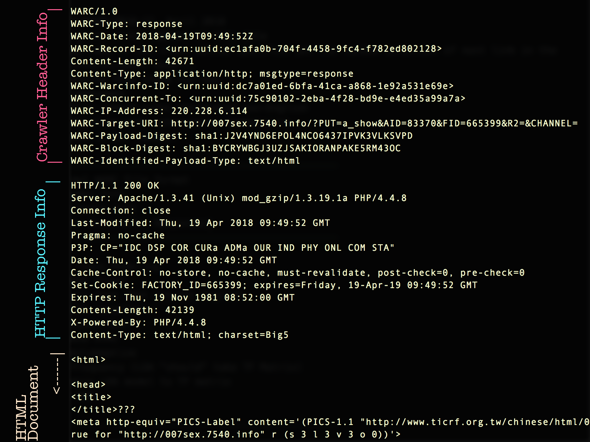
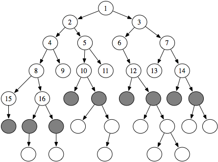

# common-crawl
Looking at the Common Crawl Web Corpus

--------------------------------------------------------

# Common Crawl
  * non-profit using crawlers to index the web

--------------------------------------------------------

# WARC (Web Archive) Full File Format
  * WAT Files : Metadata
  * WET Files: extracted plaintext data

--------------------------------------------------------

# Naming Conventions of Dumps
  * http://commoncrawl.org/2018/05/april-2018-crawl-archive-now-available/
  * CC-MAIN-<Year>-<dump#> : these are happening monthly

--------------------------------------------------------

# Data
  * Chose CC-MAIN-2018-17, April 2018
    * Getting the first segment of this data
      * For current purposes, assuming random-enough sample from the head of this data
  * In all languages
    * Keeping all records BUT removing all non-alpha characters
      * Export to new corpus csv in order to re-import
      * Pipeline with tokenizers, lemmatizers
  * There's lots of porn on the internet
--------------------------------------------------------
# Common Crawl WARC File format
  * WARC Header Info
    * Crawler Data
  * HTTP Response Info
    * Standard
  * HTML (For Successful Responses)

--------------------------------------------------------
# How the Crawler Works, ie "How Random is Our Sample?"
  * Breadth-first traversal of multi-child tree
   * Within 4 links of homepages of top 40 million domains

--------------------------------------------------------
# Our Plan: Topic Modeling
  * Using WARC files
    * Drop all rows that are not English
      * `<html lang="en">`
    * Preprocess Text
      * remove HTML
      * Stem/Lemmatize
    * Term Frequency (LDA "should" take TF Matrix)
  * Apply basic LDA model to TF matrix
  * Move to AWS

--------------------------------------------------------
# Our Reality
  * Using WET files
    * Trouble extracting just HTML Document from HTTP response in WARC
    * Dropping all non-alpha characters using regex
      * Exporting each document to .csv file to read into Spark Dataframe
    * HTML already stripped
  *

--------------------------------------------------------
# Future Considerations for More Robust Model
  * Use CDX Server API (https://github.com/webrecorder/pywb/wiki/CDX-Server-API)
  * Better to split out english language based on metatags in the full WARC files
  *
