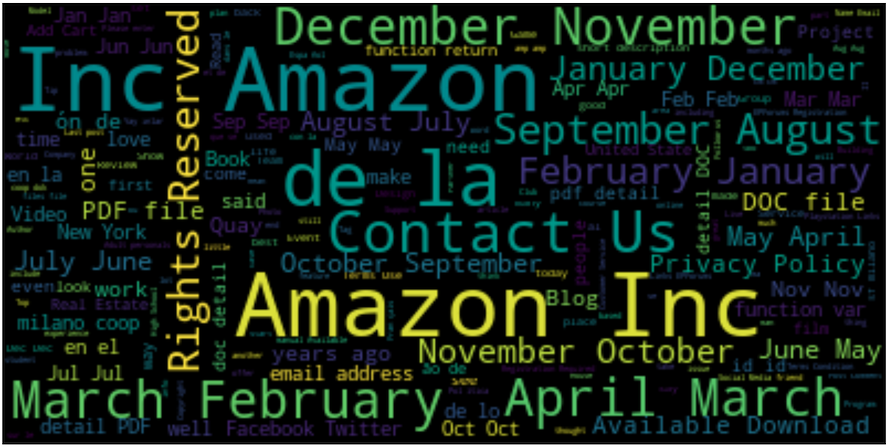
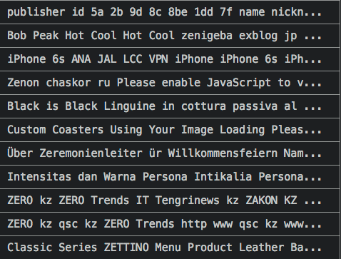
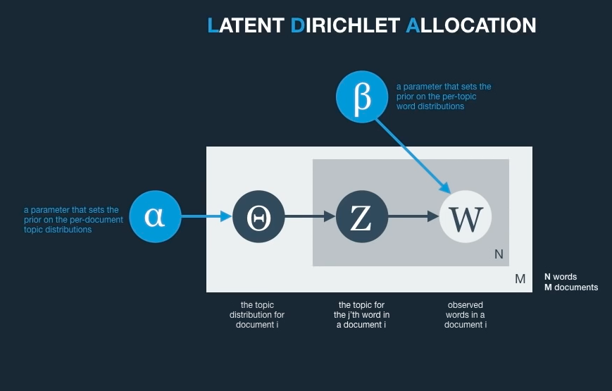

--------------------------------------------------------

# Common Crawl
  * non-profit using crawlers to index the web

 
 
 
 
 
 
 
 

--------------------------------------------------------
# What We Did
  * Spent a long time getting the data in a form we could use
  * Ran a local Spark ML LDAmodel on stemmed corpus of website texts

--------------------------------------------------------
# 3 File Formats
  * WARC (Web Archive) Full File Format
  * WAT Files : Metadata, headers
  * WET Files: extracted plaintext data

   
   
   
   
   
   
   
   

--------------------------------------------------------

# Naming Conventions of Dumps
  * http://commoncrawl.org/2018/05/april-2018-crawl-archive-now-available/
  * CC-MAIN-\<Year>-\<dump#> : these are happening monthly since ~2015

   
   
   
   
   
   
   
   

--------------------------------------------------------

# Data
  * Chose CC-MAIN-2018-17, April 2018
    * Getting the first segment of this data
      * For current purposes, assuming random-enough sample from the head of this data
  * In all languages
  * There's lots of porn on the internet

   
   
   
   
   
   
   
   

--------------------------------------------------------
# Common Crawl WARC File format
  * WARC Header Info
    * Crawler Data
  * HTTP Response Info
    * Standard
  * HTML (For Successful Responses)

 
 
 
 
 
 
 
 

--------------------------------------------------------
# How the Crawler Works, ie "How Random is Our Sample?"
  * Breadth-first traversal of multi-child tree
   * Within 4 links of homepages of top 40 million domains
     * Consider there are ~1.8 billion sites active websites

 
 
 
 
 
 
 
 

--------------------------------------------------------
# Our Current Corpus

 * Thoughts:
   * Seems that our subsample is not very random
     * Probably pulled links from a financial report or link farm
   * We should random sample from multiple Segments of the Data instead of just the first segment

 
 
 
 
 
 
 
 

--------------------------------------------------------
# Our Plan: Topic Modeling
  * Using WARC files (text with HTML tags + metadata)
    * Drop all rows that are not English
      * `<html lang="en">`
    * Preprocess Text
      * remove HTML
      * Stem/Lemmatize
    * Term Frequency (LDA "should" take TF Matrix)
      * However, TF-IDF is often used
  * Apply basic LDA model to TF matrix
  * Attempting move to AWS

 
 
 
 
 
 
 
 

--------------------------------------------------------

# Our Reality
  * Using WET files (text data only)
    * Trouble extracting just HTML Document from HTTP response in WARC
    * Keeping all records (~170 MB, ~36,000 records)
    * Dropping all non-alpha characters using regex
      * Exporting each document to .csv file to read into Spark Dataframe
    * HTML already stripped
    * Using regex to remove all non alpha characters
      * preserves some letters with accents
      * thus latin character languages are included
    * Export to csv in order to re-import
      * Scripts on cc-pyspark repo returned all pages as single doc
    * Many documents are just a single link's text
  * Run LDA in Spark locally on first segment
    * 5 topics
    * 1-grams, TF matrix as input
    * token length > 3
    * stemmed using default Spark ML stemmer (Snowball)
    * English, Spanish and French stop words
  * Attempting Spark.ML LDA on AWS EMR (Elastic Map Reduce)

 
 
 
 
 
 
 
 

--------------------------------------------------------
# A little about LDA
  * Model sees words in documents
  * Documents are represented as a distribution of topics
  * Topics are considered to be distributions of words
  * Alpha and Beta priors are taken from Dirichlet distribution

 
 
 
 
 
 
 
 

--------------------------------------------------------
# Results
  * Working local model

| topic | Term Indices |Term Weights
|-----|-----------|-------|
|0    |[0, 10, 11, 14, 28, 9, 2, 5, 109, 27]    |[0.0058, 0.0051, 0.0046, 0.0045, 0.0040, 0.0039, 0.003, 0.0033, 0.003, 0.0032]|
|1    |[1, 12, 23, 37, 4, 25, 81, 89, 90, 125]  |[0.0174, 0.0111, 0.0078, 0.0072, 0.0061, 0.0056, 0.0054, 0.0043, 0.0037, 0.0036]  |
|2    |[15, 13, 19, 32, 61, 82, 93, 96, 79, 117]|[0.01365, 0.0136, 0.0127, 0.0106, 0.0088, 0.0078, 0.0075, 0.0059, 0.0058, 0.0052]     |
|3    |[2, 0, 6, 5, 163, 46, 192, 75, 3, 73]    |[0.0070, 0.0063, 0.0061, 0.0058, 0.0042, 0.0041, 0.0039, 0.0038, 0.0038, 0.0037]  |
|4    |[22, 8, 7, 30, 36, 45, 20, 169, 38, 27]  |[0.01023, 0.0099, 0.0098, 0.0069, 0.0068, 0.0064, 0.0060, 0.0055, 0.0052, 0.0050]    |

* Term Indices
  * Showing top 10-weighted terms for a given topic

# Ran out of time to get the actual words from the topics :/

 
 
 
 
 
 
 
 

--------------------------------------------------------
# Future Considerations for More Robust Model
  * During text pre-processing, drop all documents less than a certain number of words
  * Use CDX Server API (https://github.com/webrecorder/pywb/wiki/CDX-Server-API)
  * Better to split out english language based on metatags in the full WARC files
    * OR, use language detection on documents and separate into separate corpora for analysis
  * If subsampling, random sample from each Segment of a given Crawl dump
